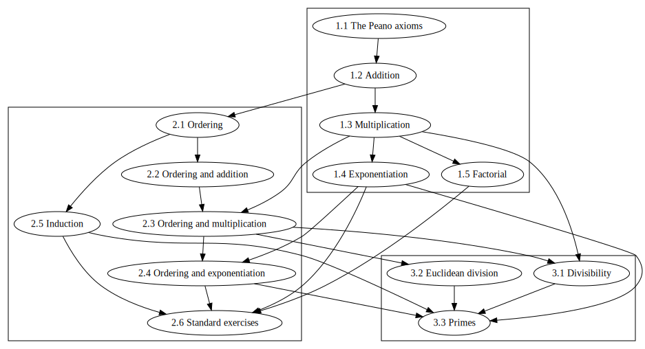

# Natural numbers

**Note:** A revised version of this formalization is contained in the Naproche
component of [Isabelle 2021-1][1], i.e. in `naproche-20211211`.

---

- **Author:** Marcel Schütz (2021)

- **Required Naproche version:** `naproche-755224402e36` (component of [Isabelle 2021][2])

- **Required amount of free memory:** ~ 400 MB

- **Approximate verification time:** ~ 5 min

---

This is a formalization of (second-order) [Peano arithmetic][3]. It introduces
basic arithmetical operations like additionl, multiplication and exponentiation,
the standard ordering on the natural numbers and the notions of divisibility and
primes.

## Contents

1.  Arithmetic

    1.1 The Peano axioms  
    1.2 Addition  
    1.3 Multiplication  
    1.4 Exponentiation  
    1.5 Factorial

2.  Ordering

    2.1 Ordering  
    2.2 Ordering and addition  
    2.3 Ordering and multiplication  
    2.4 Ordering and exponentiation  
    2.5 Induction  
    2.6 Standard exercises

3.  Divisibility

    3.1 Divisibility  
    3.2 Euclidean division  
    3.3 Primes

[1]: <https://isabelle.in.tum.de/website-Isabelle2021-1/index.html>
[2]: <https://isabelle.in.tum.de/website-Isabelle2021/index.html>
[3]: <https://en.wikipedia.org/wiki/Peano_axioms>
