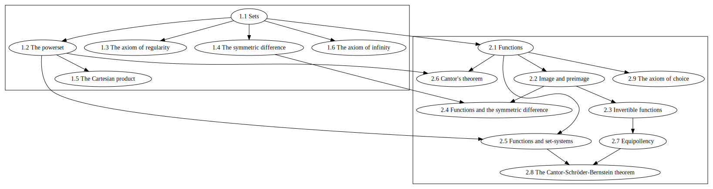

# Sets and functions

---

- **Author:** Marcel Schütz (2021)

- **Required Naproche version:** [Isabelle/Naproche 2021][1]

- **Required amount of free memory:** ~ 500 MB

- **Approximate verification time:** ~ 30 min

- **Verified with:** [E 2.5][2]

---

This is a formalization of [Zermelo-Fraenkel set theory with choice][3] (ZFC)
together with a separated axiomatization of functions. It introduces the axioms
of ZFC and the basic operations and relations between sets and functions.

## Contents

1.  Sets
    1.  Sets
    2.  The powerset
    3.  The axiom of regularity
    4.  The symmetric difference
    5.  The Cartesian product
    6.  The axiom of infinity
2.  Functions
    1.  Functions
    2.  Image and preimage
    3.  Invertible functions
    4.  Functions and the symmetric difference
    5.  Functions and set-systems
    6.  Cantor's theorem
    7.  Equipollency
    8.  The Cantor-Schröder-Bernstein theorem
    9.  The axiom of choice

[1]: <https://isabelle.in.tum.de/index.html>
[2]: <https://wwwlehre.dhbw-stuttgart.de/~sschulz/E/Archive.html>
[3]: <https://en.wikipedia.org/wiki/Zermelo%E2%80%93Fraenkel_set_theory>
