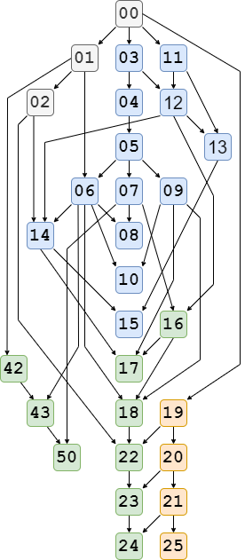

# Representation Theory in ForTheL
These are formalizations of some notions and statements from linear algebra, category theory and representation theory of algebras to be checked by Naproche-SAD.

More details on the (original) linear algebra formalizations are given [here](../linear_algebra_ftl).

To run the formalizations in Naproche-SAD, create a folder "RepresentationTheory" inside the "examples" folder and paste the FTL files there.

To reduce unnecessary prerequisites, the files only read in the topics that are needed.
These file readings are shown in the following graph.

