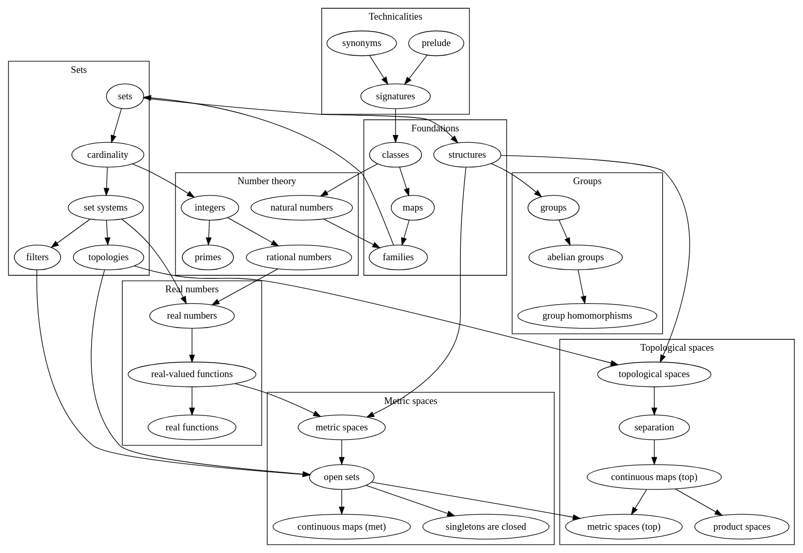

# Mathematical structures

This is an approach of a general theory about mathematical structues that
provides a way of writing ForTheL-texts about them in a quite natural style.

## Overview

The following graph shows how the files in this collection depend on each other.

## Usage

The files in this directory are designed to work in a special
[fork](https://github.com/McEarl/Naproche-SAD) of Naproche-SAD.
See
[changelog](https://github.com/McEarl/Naproche-SAD/blob/master/CHANGELOG.md)
for a list of aspects in which this fork differs from the original version of
Naproche-SAD.
